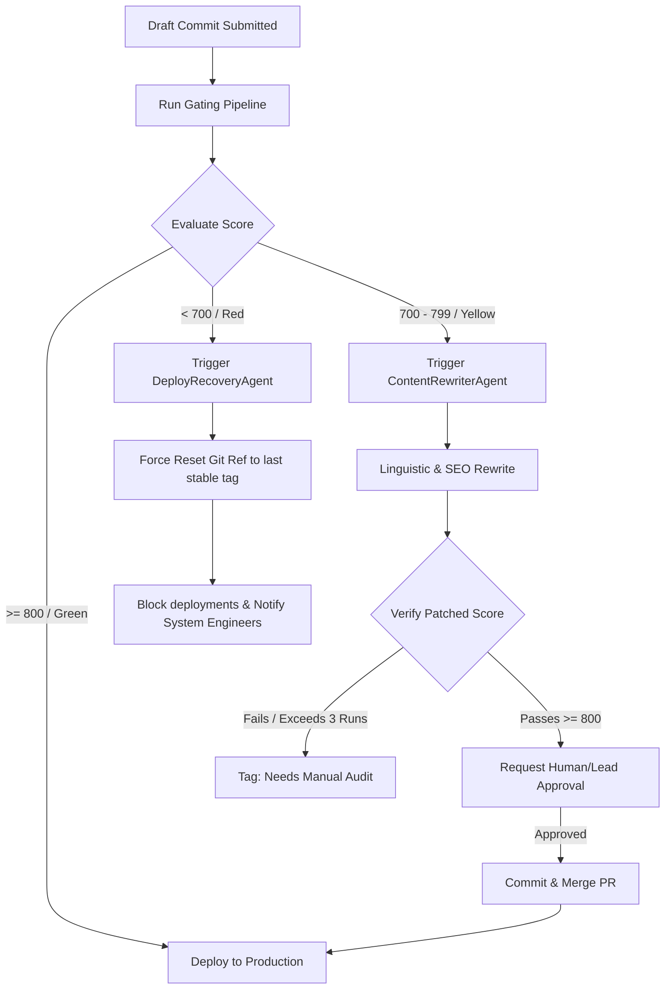

# Autonomous Agent Layer Detailed Architecture

This document defines the interface specifications, security parameters, and communication diagrams for the three autonomous agents.

---

## 1. Agent Specifications

### 1.1. DeployRecoveryAgent (P0 Recovery Controller)
1. **Responsibilities:** Monitors deployment gates, catches build failures, and performs repository rollbacks.
2. **Allowed MCPs:** `github`, `cloudflare`, `sqlite`
3. **Forbidden MCPs:** `playwright`, `postgres`, `fetch`, `context7`
4. **Input:**
   ```typescript
   interface RollbackTrigger {
     executionId: string;
     failingCommit: string;
     gateScore: number;
     failingPlugin: string;
   }
   ```
5. **Output:**
   ```typescript
   interface RollbackResult {
     success: boolean;
     restoredCommit: string;
     restoredTag: string;
     logs: string[];
   }
   ```
6. **Runtime limits:** Max execution duration: 15,000ms. CPU usage cap: 50%.
7. **Failure handling:** If rollback execution fails, escalate immediately by triggering system alerts and locking the deployment environment.
8. **Rollback rules:** Must rollback only to commits tagged with release numbers (e.g. `plugin-layer-v1`).
9. **Governor integration:** Intercepts `publish_gate_red` signals, reports CPU and time consumed to the budget accumulator.
10. **GitHub integration:** Queries GitHub status APIs, performs force-branch resets, and posts commit comments.

---

### 1.2. ContentRewriterAgent (P1 Self-Healing Loop)
1. **Responsibilities:** Patches text and metadata tags to fix failing readability, SEO, and structural audits.
2. **Allowed MCPs:** `context7`, `sqlite`, `memory`
3. **Forbidden MCPs:** `github`, `cloudflare`, `postgres`, `playwright`
4. **Input:**
   ```typescript
   interface RewriterInput {
     filePath: string;
     originalContent: string;
     failingChecks: Array<{ checkName: string; score: number; feedback: string }>;
   }
   ```
5. **Output:**
   ```typescript
   interface RewriterOutput {
     patchedContent: string;
     iterations: number;
     improvementScore: number;
   }
   ```
6. **Runtime limits:** Max execution duration: 25,000ms. Max iterations: 3 attempts.
7. **Failure handling:** If score remains below threshold after 3 attempts, abort rewriting, tag the issue as "Needs Manual Action", and notify dev team.
8. **Rollback rules:** If a rewrite results in a lower score than the preceding attempt, discard changes and restore the previous revision.
9. **Governor integration:** Gated to execution budget limits. Whitelist constraints block any write operations outside designated markdown folders.
10. **GitHub integration:** Dispatches git branch checkout tasks and creates a Pull Request for manual verification.

---

### 1.3. TrendDiscoveryAgent (P2 Scheduler Analyzer)
1. **Responsibilities:** Scrapes Google algorithm RSS feeds and searches traffic data to suggest new programmatic keywords.
2. **Allowed MCPs:** `fetch`, `postgres`, `sqlite`, `memory`
3. **Forbidden MCPs:** `github`, `cloudflare`, `playwright`
4. **Input:**
   ```typescript
   interface DiscoveryInput {
     lastCheckedTimestamp: string;
     targetCategories: string[];
   }
   ```
5. **Output:**
   ```typescript
   interface DiscoveryOutput {
     discoveredTrends: Array<{ keyword: string; volume: number; difficulty: number }>;
     suggestedPages: string[];
   }
   ```
6. **Runtime limits:** Max execution duration: 30,000ms. Runs once daily.
7. **Failure handling:** Graceful degradation. If connection to search trends fails, scan the local historical database.
8. **Rollback rules:** None (read-only monitoring).
9. **Governor integration:** Budgeted under the `on-schedule` sequence.
10. **GitHub integration:** Creates new issues containing recommended keywords and assigns them to content loops.

---

## 2. Interaction Diagram

```mermaid
sequenceDiagram
    participant GH as GitHub Hook
    participant Gov as System Governor
    participant DRA as DeployRecoveryAgent
    participant CRA as ContentRewriterAgent
    participant TDA as TrendDiscoveryAgent
    participant Skills as Centralized Skills Library

    rect rgb(15, 23, 42)
        note over GH, DRA: Deployment Gating Loop (Red/Yellow Bands)
        GH->>Gov: Commit push / Hook check trigger
        Gov->>Gov: Score evaluated (< 700 / Red)
        Gov->>DRA: Alert: publish_gate_red
        DRA->>Skills: Run deployment rollback commands
        Skills-->>DRA: Rollback complete
        DRA->>GH: Force push stable commit
    end

    rect rgb(30, 41, 59)
        note over GH, CRA: Self-Healing Loop (Yellow Band)
        Gov->>Gov: Score evaluated (700-799 / Yellow)
        Gov->>CRA: Alert: publish_gate_yellow
        CRA->>Skills: Run text & SEO analysis skills
        Skills-->>CRA: Diagnostic logs
        CRA->>CRA: LLM Rewrite (Max 3 iterations)
        CRA->>GH: Commit patch branch / Create Pull Request
    end
```



---

## 3. Execution & Approval Flow


