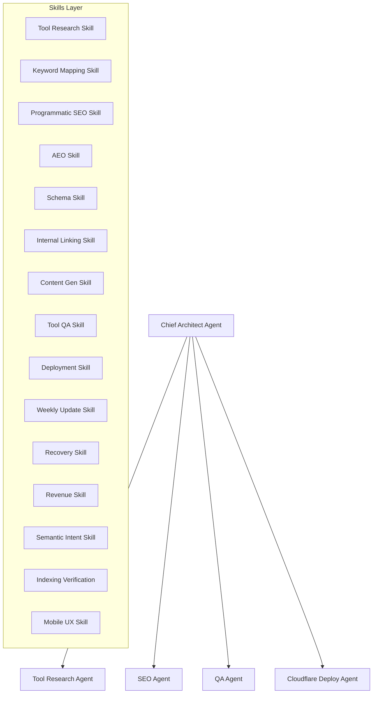

# Agent Swarm & Skills Matrix Specification

This document maps the relationship between the **15 Skills** (Skills Layer) and the **12 Agents** (Agents Layer) in the SEO-AEO Platform.

---

## 1. Swarm Execution Architecture

---

## 2. Skills Layer Definitions (1–15)

1.  **Tool Research Skill:** Analyzes search demand, competition volume, and prioritization.
2.  **Keyword Mapping Skill:** Evaluates keyword intent categories and SERP layouts.
3.  **Programmatic SEO Skill:** Generates scalable page templates, dynamic path routing, and tag catalogs.
4.  **AEO Skill:** Validates direct answers, AI-engine parseability (e.g. `llms.txt`), and speakable attributes.
5.  **Schema Skill:** Validates syntax of JSON-LD schemas (Article, Breadcrumbs, FAQ).
6.  **Internal Linking Skill:** Audits Jaccard similarity between link clusters and builds internal anchor distributions.
7.  **Content Generation Skill:** Scores text via Flesch readability, EEAT parameters, and flags thin or spam-like text.
8.  **Tool QA Skill:** Conducts broken link checks, form validations, and keyboard navigation.
9.  **Deployment Skill:** Checks package build sizes, lockfile integrity, and staging routes.
10. **Weekly SEO Update Skill:** Scheduled auditor inspecting index coverage and فنی regression signals.
11. **Google Update Recovery Skill:** Identifies update impacts and schedules rollback sequences.
12. **Revenue Optimization Skill:** Evaluates AdSense policy conformance, ad units, and RPM priority scores.
13. **Semantic Intent Verification:** Computes vector-based topic densities against target niches.
14. **Google Indexing Verification:** Assesses canonical URLs and sitemap coverage in GSC.
15. **Mobile UX Verification:** Measures Cumulative Layout Shift (CLS) and viewport constraints.

---

## 3. Agent to Skills Mapping Matrix

| Agent | Mapped Skills | Primary Responsibilities |
| :--- | :--- | :--- |
| **Chief Architect Agent** | Consumes all skills | Coordinates job state transitions and enforces Governor budget gating. |
| **Tool Research Agent** | `1`, `2`, `13` | Discovers niches, evaluates competition levels, and maps search intent. |
| **SEO Agent** | `3`, `6`, `14` | Generates linking structures and verifies index coverage parameters. |
| **AEO Agent** | `4` | Optimizes structured pages for LLM searches (ChatGPT, Gemini, etc.). |
| **Schema Agent** | `5` | Validates JSON-LD structures to prevent rich result warnings. |
| **Content Agent** | `7`, `13` | Generates readability-safe body copy and checks E-E-A-T trust signals. |
| **QA Agent** | `8`, `15` | Runs Playwright tests, accessibility audits, and verifies mobile UX. |
| **Cloudflare Deploy Agent** | `9` | Provisions pages on staging/production and tracks build limits. |
| **Revenue Agent** | `12` | Places AdSense banners and checks traffic monetization RPM. |
| **Trend Discovery Agent** | `2`, `10` | Monitors RSS developer blogs for Google algorithm changes daily. |
| **Recovery Agent** | `11` | Rolls back repositories to previous stable tags during red-band failures. |
| **Content Rewriter Agent** | `7`, `13` | Optimizes text drafts iteratively to meet quality gate thresholds. |
