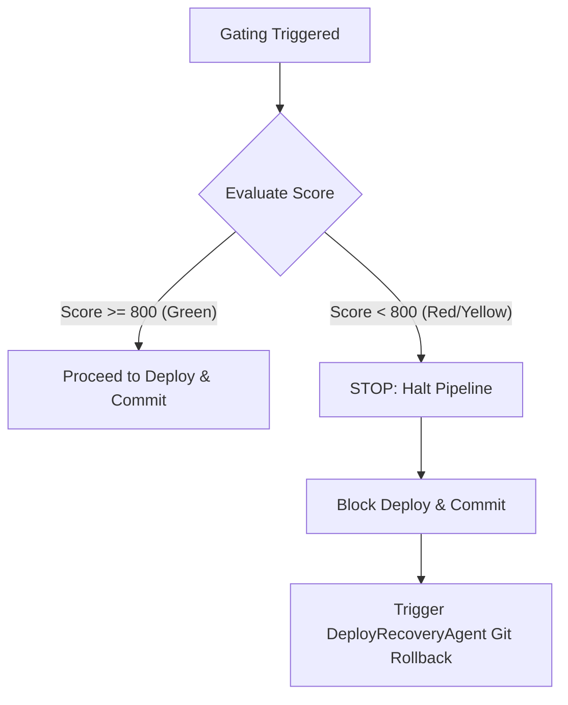

# Agent Swarm Capabilities & Gating Specification

This document specifies the capabilities, check mappings, scoring mechanics, and lifecycle behavior of the **8 Autonomous Agents** and the **Weekly SEO Operations Agent** within the SEO-AEO Platform.

---

## 1. Unified Gating Policy (Score: 0–1000)

Every page and tool generated or updated by the platform must be scored on a scale from **0 to 1000**. The [System Governor](file:///root/src/plugins/engine/governor.ts) enforces a strict **fail-closed** gating policy:

> [!IMPORTANT]
> **Threshold Rule:** `Score < 800` triggers an immediate **STOP** condition.
> *   **NO Deploy** to Cloudflare Pages (staging or production).
> *   **NO Publish** route updates.
> *   **NO Commit** or push to the remote GitHub repository.
> *   **Trigger Rollback:** The [DeployRecoveryAgent](file:///root/src/orchestrator/agents.ts#L52-L72) immediately executes a hard rollback to the last stable release tag (`plugin-layer-v1`).



---

## 2. The 8 Autonomous Agents Capabilities Mapping

The 8 specialized agents manage specific domains of the page generation and validation lifecycle. Each check item is mapped to its responsible agent:

### Agent 1: Research Agent
*   **Role:** Analyzes market niches, traffic gaps, and monetization opportunities.
*   **Mapped Checks:**
    *   **Competition Analysis:** Evaluates competitor authority level and search intent layout.
    *   **Keyword Analysis:** Scrapes search volume thresholds for programmatic keywords.
    *   **SERP Analysis:** Maps SERP layouts to identify target snippets.
    *   **Monetization Analysis:** Estimates AdSense potential RPM and commercial value.

### Agent 2: Keyword Agent
*   **Role:** Curates keyword lists and refines entities for topical authority.
*   **Mapped Checks:**
    *   **Google Search Essentials:** Validates keyword target lists against crawlability standards.
    *   **Entity Optimization:** Maps entity profiles to Wikidata registry references to improve semantic density.

### Agent 3: Tool Planning Agent
*   **Role:** Designs the architecture, technical scope, and data schemas of programmatic tools.
*   **Mapped Checks:**
    *   **Tool Scope:** Defines functional inputs, outputs, and dependencies for Astro tools.
    *   **Architecture:** Validates modular layout structures and file mapping directories.
    *   **Database Design:** Audits SQLite and Postgres schemas using database planning skills.

### Agent 4: Tool Building Agent
*   **Role:** Programmatically compiles HTML, JavaScript, and CSS templates using AST builders.
*   **Mapped Checks:**
    *   **Page Structure:** Audits structural DOM layout constraints and accessibility anchors.
    *   **Form Validation:** Verifies JavaScript validation rules for dynamic forms and calculator tools.

### Agent 5: Content Agent
*   **Role:** Audits copy readability, citation standards, and AI-search visibility.
*   **Mapped Checks:**
    *   **Spam Policies:** Enforces originality thresholds and detects low-quality boilerplate text.
    *   **Citation Readiness:** Scrapes author bios and Wikidata references to establish EEAT authority.
    *   **ChatGPT / Gemini / Perplexity / AI Overviews:** Audits formatting for direct answers and AI parsing compatibility.

### Agent 6: Internal Linking Agent
*   **Role:** Maps internal linking pathways and validates structured page schema.
*   **Mapped Checks:**
    *   **Structured Data:** Validates JSON-LD schema parsing (Article, FAQ, Breadcrumbs).
    *   **Indexability:** Verifies canonical tag configuration, hreflang, robots.txt, and sitemap registration.

### Agent 7: QA Agent
*   **Role:** Performs automated functional, browser-rendering, and compliance testing.
*   **Mapped Checks:**
    *   **Playwright:** Audits cumulative layout shift (CLS), loading speed, and console errors.
    *   **Accessibility:** Triggers axe-core tests to verify WCAG contrast and keyboard navigation.
    *   **Broken Links:** Checks external and internal link integrity to prevent 404s.
    *   **CWV:** Measures Core Web Vitals performance parameters.

### Agent 8: Deployment Agent
*   **Role:** Handles CI/CD pipelines, remote git coordination, and edge network delivery.
*   **Mapped Checks:**
    *   **Cloudflare:** Audits Pages stage settings and edge environment bindings.
    *   **GitHub:** Commits code, creates PRs, and tracks repository workflow health.
    *   **Rollback:** Restores previous stable tagged version on gating failures.
    *   **Production Validation:** Monitors live routes post-deployment.

---

## 3. Weekly SEO Operations Agent

The **Weekly SEO Operations Agent** runs on a scheduled cron job (`on-schedule`) to execute a comprehensive 8-step site health audit:

```
[Start] ──> Crawl Site ──> Find Weak Pages ──> Find Orphan Pages ──> Find Missing Schema
        ──> Find Thin Content ──> Find Broken Links ──> Find Indexing Issues ──> Find AEO Gaps ──> [Done]
```

### The 8 Operational Steps:
1.  **Crawl Site:** Uses the Playwright skill to scrape and index all local routes.
2.  **Find Weak Pages:** Flags pages that have not been updated for 90 days.
3.  **Find Orphan Pages:** Identifies published pages that contain zero inbound internal link references.
4.  **Find Missing Schema:** Audits pages for missing `Article`, `FAQPage`, or `BreadcrumbList` JSON-LD schemas.
5.  **Find Thin Content:** Flags pages containing fewer than 300 words.
6.  **Find Broken Links:** Scans HTML anchors for broken internal path patterns.
7.  **Find Indexing Issues:** Detects missing canonical urls, incorrect sitemap tags, or unexpected `noindex` headers.
8.  **Find AEO Gaps:** Checks search intent alignment and verifies direct-answer formatting for LLM engines.
