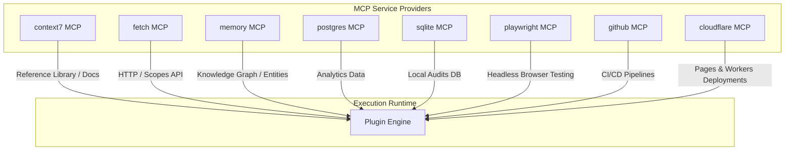

# SEO/AEO Platform — Architecture Report

> **Document Version:** v1.0.0  
> **Target Environment:** AstroJS, Cloudflare Pages/Workers, PostgreSQL, SQLite  
> **Status:** Finalized  

---

## 1. System Topology & MCP Server Registry

The platform is designed to operate autonomously by bridging a local TypeScript execution layer with external tooling through the Model Context Protocol (MCP). The following MCP servers form the core service layer:



### Registered MCP Servers & Capabilities
1.  **`context7`:** Provides document resolution and reference documentation mapping (e.g. searching schemas or technical guidelines).
2.  **`fetch`:** Facilitates HTTP network requests to read external APIs, scraping search trends, and auditing Google RSS updates.
3.  **`memory`:** Manages the persistent Entity-Relation Knowledge Graph, storing historic content observations and algorithm update impacts.
4.  **`postgres`:** Interfaces with the primary operational database for site analytics and production metrics.
5.  **`sqlite`:** Provides a lightweight, local relational storage (`/root/.gemini/antigravity-cli/data/plugins.db`) to log plugin audit results and execution history.
6.  **`playwright`:** Drives headless browser instances to perform visual rendering checks and DOM diagnostics.
7.  **`github`:** Queries branch commits, validation status of actions, and CI build flags.
8.  **`cloudflare`:** Monitors edge worker deployment sizes and Cloudflare Pages build outputs.

---

## 2. Plugin Registry & Hook Routing

The system includes **nine production plugins** containing a combined total of **47 checks**. Plugins bind to one or more lifecycle hooks to control content progression.

### Hook Execution Flow

```mermaid
sequenceDiagram
    participant Platform as Platform Pipeline
    participant Engine as Plugin Executor
    participant DB as SQLite / Memory Graph

    rect rgb(30, 41, 59)
        note right of Platform: Hook: pre-publish (Gating Stage)
        Platform->>Engine: executePrePublish(context)
        Engine->>Engine: Run: quality-gatekeeper (fail-closed, blocks < 800)
        Engine->>Engine: Run: tool-research-engine (fail-open)
        Engine->>Engine: Run: tool-planner (fail-open)
        Engine->>Engine: Run: qa-automation (fail-closed, blocks < 70)
        Engine->>Engine: Run: deployment-guardian (fail-closed, blocks < 80)
        Engine-->>Platform: Approved (Boolean) / Execution Logs
    end

    rect rgb(15, 23, 42)
        note right of Platform: Hook: post-build (Audit Stage)
        Platform->>Engine: executePostBuild(context)
        Engine->>Engine: Run: seo-auditor (fail-open)
        Engine->>Engine: Run: aeo-auditor (fail-open)
        Engine->>Engine: Run: qa-automation (fail-closed)
        Engine->>Engine: Run: google-update-engine (fail-open)
        Engine-->>Platform: Audit Scorecard / Diagnostics
    end

    rect rgb(30, 30, 30)
        note right of Platform: Hook: on-schedule (Ops Stage)
        Platform->>Engine: executeScheduled(context)
        Engine->>Engine: Run: google-update-engine (fail-open)
        Engine->>Engine: Run: weekly-seo-engine (fail-open)
        Engine->>Engine: Run: quality-gatekeeper / seo-auditor / aeo-auditor (fail-open)
        Engine->>DB: Log Audit History / Update Entities
        Engine-->>Platform: Health Report / System Aggregates
    end
```



---

## 3. Detailed Plugin Specifications & Dependencies

| Plugin | Core Purpose | Active Checks | Failure Mode | Threshold | MCP Dependencies |
| :--- | :--- | :---: | :---: | :---: | :--- |
| **[quality-gatekeeper](file:///root/src/plugins/quality-gatekeeper/index.ts)** | Blocks poor-quality pages from publishing | 7 | `fail-closed` | `800/1000` | *None (Local Math/Regex)* |
| **[seo-auditor](file:///root/src/plugins/seo-auditor/index.ts)** | Audits Technical SEO and Adsense Compliance | 12 | `fail-open` | `70/100` | *None (Local HTML Regex)* |
| **[aeo-auditor](file:///root/src/plugins/aeo-auditor/index.ts)** | Rates readiness for LLM conversational search engines | 10 | `fail-open` | `65/100` | *None (Local JSON-LD/HTML)* |
| **[tool-research-engine](file:///root/src/plugins/tool-research-engine/index.ts)** | Evaluates market viability of new program pages | 3 | `fail-open` | `60/100` | `fetch`, `memory`, `context7` |
| **[tool-planner](file:///root/src/plugins/tool-planner/index.ts)** | Validates code architecture, URLs, and database plans | 3 | `fail-open` | `65/100` | `memory`, `sqlite`, `postgres` |
| **[qa-automation](file:///root/src/plugins/qa-automation/index.ts)** | Audits layout shift, rendering, and accessibility | 3 | `fail-closed` | `70/100` | `playwright` |
| **[deployment-guardian](file:///root/src/plugins/deployment-guardian/index.ts)** | Safeguards Cloudflare worker and git deployment pipeline | 3 | `fail-closed` | `80/100` | `github`, `cloudflare` |
| **[google-update-engine](file:///root/src/plugins/google-update-engine/index.ts)** | Audits resilience against Google core update algorithms | 3 | `fail-open` | `55/100` | `fetch`, `memory`, `sqlite` |
| **[weekly-seo-engine](file:///root/src/plugins/weekly-seo-engine/index.ts)** | Performs scheduled weekly cleanup and metadata sync | 3 | `fail-open` | `60/100` | `sqlite`, `postgres`, `memory`, `fetch`, `playwright` |

---

## 4. Current Architecture Strengths & Bottlenecks

### 4.1. Core Architectural Strengths
*   **Decoupled Local Execution:** Heavily optimized local parsing logic (utilizing lightweight string search, regex scans, and n-gram analysis) avoids unnecessary DOM overhead. Plugins run efficiently in sandboxed V8 environments (such as Cloudflare Workers).
*   **Isolated Fault-Tolerance:** Each plugin check runs inside a 10-second timeout guard. If Playwright or database queries freeze, they score `0` and abort immediately, preventing build or publishing steps from hanging.
*   **Configurable Gating Policies:** The distinction between `fail-closed` (hard publishing block for Quality, QA, and Deployment) and `fail-open` (advisory scoring for SEO, AEO, and Google Update updates) ensures reliability without blocking minor diagnostic issues.
*   **Graceful Degradation:** Standalone CLI runtimes or test runs safely fall back to a mock mode when external MCP servers are offline, ensuring stability across dev and production pipelines.

### 4.2. Current Architectural Bottlenecks
*   **Synchronous Sequential Execution:** All checks within a plugin run sequentially. In large programmatic deployments where thousands of pages are generated, executing 47 checks sequentially (taking ~468ms per page) introduces significant latency in the build pipeline.
*   **Regex-based Parsing Limits:** Relying on regular expressions rather than an abstract syntax tree (AST) or HTML parser (like JSDOM or Linkedom) limits semantic heading hierarchy checks and introduces false positives on nested elements.
*   **Network Latency Exposure:** Checks that trigger network requests via `fetch` or initialize browser instances via `playwright` can fail or degrade composite scores due to temporary network issues.

---

## 5. Roadmap: Missing Skills, Agents, & Workflows

To evolve the platform towards a fully autonomous, self-healing architecture (2026–2030), the following components should be implemented:

### 5.1. Missing Platform Skills (Check Capabilities)
*   **Semantic Search Intent Matcher:** Integrate vector embeddings (e.g. via Gemini embedding endpoints) to verify if page headings and body text match target user intents.
*   **Real-time Indexing Telemetry:** Implement direct Google Search Console API checks to monitor live URL indexing status rather than relying on meta tags.
*   **Core Web Vitals Emulators:** Utilize Lighthouse-style headless metrics to calculate First Contentful Paint (FCP) and Cumulative Layout Shift (CLS) on actual mobile aspect ratios.

### 5.2. Missing Autonomous Agents
*   **The Content Re-Writer Agent:** An LLM-backed agent that takes failing checklist logs (e.g. Flesch-Kincaid readability failures, E-E-A-T trust signals missing) and automatically rewrites the AstroJS markdown front-matter or page body to achieve a passing score.
*   **The Deploy & Recovery Agent:** Monitors deployment status. If a Cloudflare Pages deploy fails or trigger errors post-publish, this agent automatically rolls back the repository commit to the last stable release tag (`plugin-layer-v1`).
*   **The Trend Discovery Agent:** Constantly queries Google Trends and competitive keyword APIs, updating database schemes to suggest new programmatic tools to build.

### 5.3. Missing Automation Workflows
*   **Self-Healing Publishing Loop:** An automated workflow that triggers whenever content fails the `pre-publish` gate:
    ```
    Content Draft -> quality-gatekeeper (FAIL) -> Content Re-Writer Agent -> Re-Scored -> quality-gatekeeper (PASS) -> Auto-Commit & Deploy
    ```
*   **Algorithm Update Response Loop:**
    ```
    google-update-engine (On-Schedule) -> Scrapes Update -> Maps vulnerability -> Tasks Re-Writer Agent -> Hotfix Build -> Deployment Guardian (PASS) -> Live Deploy
    ```
