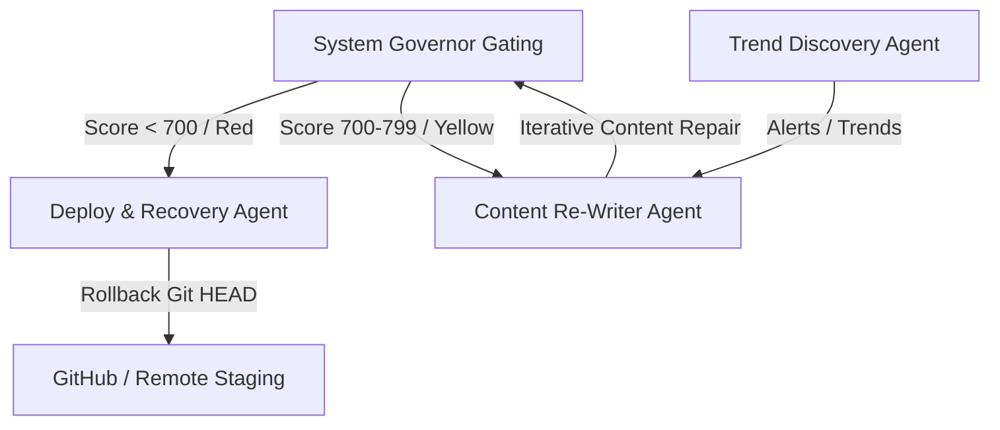

# Automated Remediation & Search Intelligence Workflows

This document specifies the operational execution loops, triggers, and state transitions for the self-healing SEO, Google Update recovery, and automated keyword discovery engines.

---

## 1. Swarm Execution Overview

The platform uses three primary self-healing and monitoring agents to coordinate recovery and search intelligence tasks:

---

## 2. Deep Dive: The 6 Core Workflows

### 2.1. Auto Self-Healing SEO
*   **Trigger:** Intercepts `publish_gate_yellow` (score 700–799) from the [System Governor](file:///root/src/plugins/engine/governor.ts).
*   **Execution Loop:**
    1.  Halts staging-to-production deployment.
    2.  Extracts failing check details (e.g., readability < 60, duplicate ratio > 0.15).
    3.  Prepares repair parameters for the Content Re-Writer Agent.
    4.  Runs repair loop.
    5.  Re-audits the page. If score is $\ge 800$, triggers production deployment; otherwise, loops up to 3 times before manual escalation.

### 2.2. Auto Google Update Recovery
*   **Trigger:** RSS monitoring flags a Google core algorithm update or a live visual regression check fails (`publish_gate_red`, score < 700).
*   **Execution Loop:**
    1.  Activates the [DeployRecoveryAgent](file:///root/src/orchestrator/agents.ts#L52-L72).
    2.  Escalates by locking the deployment branch to prevent further writes.
    3.  Performs a repository force rollback to the last stable release tagged `plugin-layer-v1`.
    4.  Sends slack/email notifications to systems engineers.

### 2.3. Auto Content Rewriter
*   **Trigger:** Invoked by the Self-Healing loop or manual content repair tickets.
*   **Execution Loop:**
    1.  Parses the target file markdown front-matter and text body.
    2.  Synthesizes a rewrite instruction payload containing:
        *   Failing score metrics.
        *   Constraint rules (preserve specific header keywords, maintain structural layout).
    3.  Runs the LLM repair generation.
    4.  Overwrites the target file and commits changes to a repair branch.

### 2.4. Auto Competitor Monitoring
*   **Trigger:** Weekly scheduled cron job (`on-schedule`).
*   **Execution Loop:**
    1.  Uses competitor discovery skills to identify top 5 ranking pages for target keywords.
    2.  Scrapes page structure, metadata configurations, and topic density.
    3.  Saves metrics in `reports/factory.db` and flags content gap opportunities (topics where competitors rank but local tool lacks coverage).

### 2.5. Auto Opportunity Discovery & Advanced Trend Engine
*   **Trigger:** Daily scheduled cron job (2:00 AM) or manual researcher request.
*   **Execution Loop:**
    1.  Scrapes Google Search Trends API and Developer update RSS feeds.
    2.  Classifies keyword search intent (commercial, informational, transactional).
    3.  Calculates priority opportunity scores:
        $$\text{Priority Score} = \frac{\text{Search Volume} \times \text{Intent Score}}{\text{Keyword Difficulty}}$$
    4.  Adds high-priority opportunities ($\ge 80$) to the SQLite database queue, ready for programmatic tool specification.

---

## 3. Workflow State Transition Matrix

| Current State | Target State | Trigger Condition | Responsible Agent | Outcome |
| :--- | :--- | :--- | :--- | :--- |
| **GATING** | **REWRITING** | Score 700–799 (Yellow) | `ContentRewriterAgent` | Draft content patched; loop counter incremented. |
| **GATING** | **RECOVERING** | Score < 700 (Red) | `DeployRecoveryAgent` | Git checkout reset to last stable tag; deploy locked. |
| **MONITORING** | **RECOVERING** | Live visual layout shift / 500 error | `DeployRecoveryAgent` | Rollback triggered; status alerts sent to devs. |
| **IDLE** | **RESEARCHING** | Cron trigger / Manual niche input | `TrendDiscoveryAgent` | SQLite opportunity table populated with keywords. |
