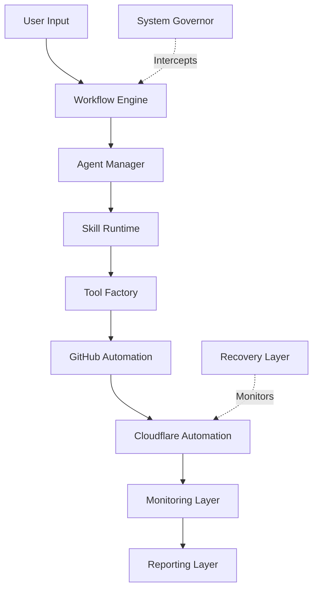
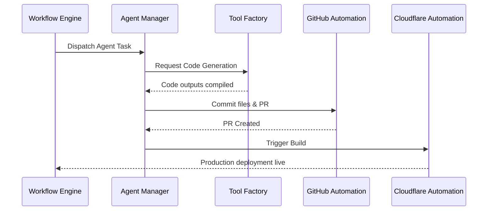
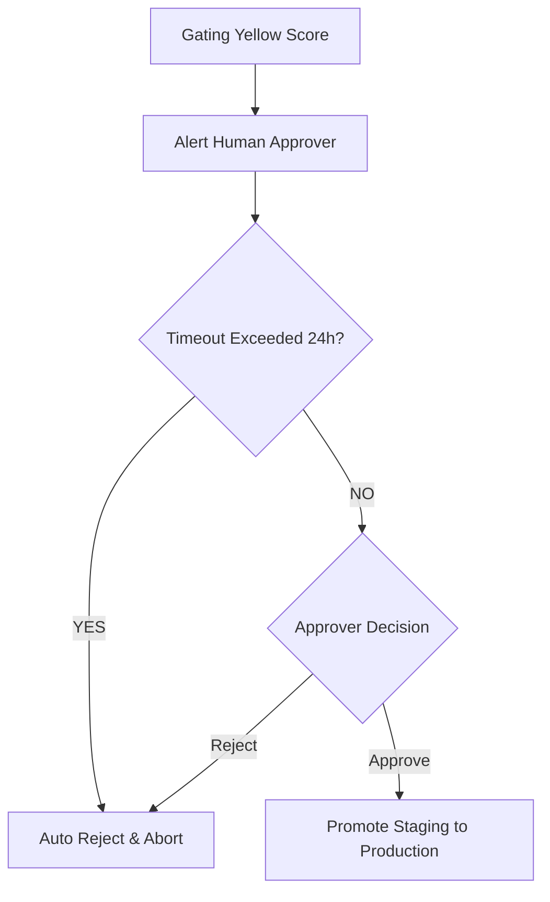
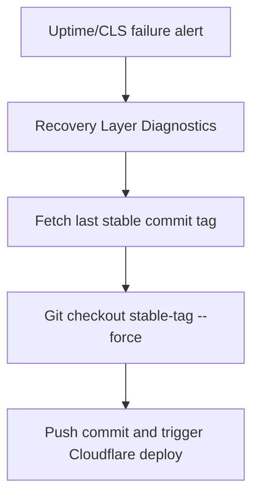

# Autonomous Tool Factory Architecture

This document outlines the complete architectural design of the **Autonomous Tool Factory**, the final orchestration layer driving automated keyword research, code generation, deployment, and indexing.

---

## 1. Module Specifications

### 1.1. Workflow Engine
- **Purpose:** Coordinates the sequential execution of task pipelines from keyword research to monitoring.
- **Inputs:** `factoryJobSpecification: JSON`
- **Outputs:** `pipelineStatus: JSON`, `executionResult: JSON`
- **Runtime Requirements:** Node.js V8 execution loop, asynchronous runner.
- **Dependencies:** Skill Runtime, System Governor.
- **Failure Conditions:** Step execution timeouts, database write lockouts.
- **Recovery Actions:** Halt sequence, log state snapshot to SQLite, notify Agent Manager.

### 1.2. Agent Manager
- **Purpose:** Spawns, monitors, and coordinates autonomous agents (`DeployRecoveryAgent`, `ContentRewriterAgent`, etc.).
- **Inputs:** `agentTaskRequest: JSON`
- **Outputs:** `agentResolutionStatus: JSON`
- **Runtime Requirements:** Isolated agent threads.
- **Dependencies:** Model Context Protocol (MCP) integrations, local event bus.
- **Failure Conditions:** Agent execution loops, token authorization expirations.
- **Recovery Actions:** Force terminate agent thread, clear budget accumulator, escalate to manual review.

### 1.3. Skill Runtime
- **Purpose:** Runs standardized low-level utilities (readability, similarity, SQL syntax validation).
- **Inputs:** `skillName: string`, `skillInput: JSON`
- **Outputs:** `skillOutput: JSON`
- **Runtime Requirements:** Sandboxed, stateless JavaScript interpreter environment.
- **Dependencies:** Skill Registry.
- **Failure Conditions:** Syllable parsing errors, external API timeouts.
- **Recovery Actions:** Fallback to offline regex match models, return warning score indicator.

### 1.4. Tool Factory
- **Purpose:** Programmatically generates code (HTML, JS, CSS) and templates for requested pages.
- **Inputs:** `keywordRequirements: JSON`, `designGuidelines: Markdown`
- **Outputs:** `generatedCode: Array<{ path: string, content: string }>`
- **Runtime Requirements:** AST parser, code validation compilers.
- **Dependencies:** Programmatic SEO Skill.
- **Failure Conditions:** Code compilation errors, invalid structural DOM.
- **Recovery Actions:** Request Code Generator Agent to self-heal and recompile code logic.

### 1.5. GitHub Automation
- **Purpose:** Manages repository versioning, branching, PR creation, and commits.
- **Inputs:** `commitPayload: JSON`
- **Outputs:** `githubStatus: JSON`
- **Runtime Requirements:** Git CLI execution environment, PAT token access.
- **Dependencies:** GitHub MCP.
- **Failure Conditions:** Git conflict errors, push authentication rejection.
- **Recovery Actions:** Pull remote branch HEAD, resolve minor conflicts, retry commit or alert DRA.

### 1.6. Cloudflare Automation
- **Purpose:** Triggers edge builds and coordinates staging/production traffic routing.
- **Inputs:** `deploymentPayload: JSON`
- **Outputs:** `deploymentStatus: JSON`
- **Runtime Requirements:** Cloudflare Pages API bindings.
- **Dependencies:** Cloudflare MCP.
- **Failure Conditions:** Staging upload size bounds exceeded, compilation crashes.
- **Recovery Actions:** Terminate deploy, request DRA to rollback git ref.

### 1.7. Human Approval Layer
- **Purpose:** Intercepts critical changes (schema modifications, yellow gating bands) to prevent errors.
- **Inputs:** `approvalRequest: JSON`
- **Outputs:** `approvalDecision: boolean`
- **Runtime Requirements:** Web UI modal interface or Slack webhook.
- **Dependencies:** Global site configs.
- **Failure Conditions:** Approver timeout (exceeding 24 hours).
- **Recovery Actions:** Default to Reject/Fail-closed, log timeout, abort workflow.

### 1.8. Monitoring Layer
- **Purpose:** Audits live URL performance, layout shifts (CLS), accessibility, and uptimes.
- **Inputs:** `targetUrls: string[]`
- **Outputs:** `auditScorecard: JSON`
- **Runtime Requirements:** Headless Chromium environment.
- **Dependencies:** Playwright MCP.
- **Failure Conditions:** Target server timeouts, console errors detected.
- **Recovery Actions:** Mark page down, report crash logs to recovery loop.

### 1.9. Reporting Layer
- **Purpose:** Consolidates execution times, audit reports, and indexing stats.
- **Inputs:** `jobId: string`
- **Outputs:** `finalJobReport: Markdown`
- **Runtime Requirements:** Markdown generator.
- **Dependencies:** Local SQLite logs.
- **Failure Conditions:** File write failures.
- **Recovery Actions:** Stream report to stdout, retry writing to `/reports/`.

### 1.10. Recovery Layer
- **Purpose:** Diagnoses rank losses and coordinates git checkout rollbacks.
- **Inputs:** `crashAlert: JSON`
- **Outputs:** `recoveryStatus: JSON`
- **Runtime Requirements:** Git force reset scripts.
- **Dependencies:** DeployRecoveryAgent.
- **Failure Conditions:** Local checkout corruptions.
- **Recovery Actions:** Re-clone repository clean instance, notify system administrator.

---

## 2. System Architecture Diagrams

### 2.1. System Diagram

### 2.2. Execution Diagram

### 2.3. Approval Diagram

### 2.4. Recovery Diagram

---

## 3. Implementation Status Audit

### 3.1. Already Implemented
- **Plugin Layer Engine:** Core manifest for running checks.
- **System Governor Lite:** Access whitelists and scoring gating bands.
- **Core Text/Linguistic Skills:** Flesch-readability, Jaccard originality, and density matching.
- **Control Web Dashboard:** Static server, UI console logger, and gating simulator.

### 3.2. Partially Implemented
- **Skills Registry Layer:** Standardized framework created, but only 3/15 skills are fully refactored from plugins.
- **GitHub Integration:** Commit staging and remote repo setups configured.

### 3.3. Missing
- **Workflow Engine Pipelines:** Automations linking research directly to tooling generators.
- **Agent Manager:** Swarm thread executors coordinating autonomous agent run cycles.
- **Deploy & Recovery Agent (DRA):** Rollback force checkout logic.
- **Content Re-Writer Agent (CRA):** Automated LLM repair prompt chains.
- **Trend Discovery Agent (TDA):** Scraper schedulers.
- **Tool Factory Generator:** Code compilation engines.
