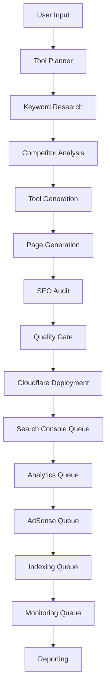
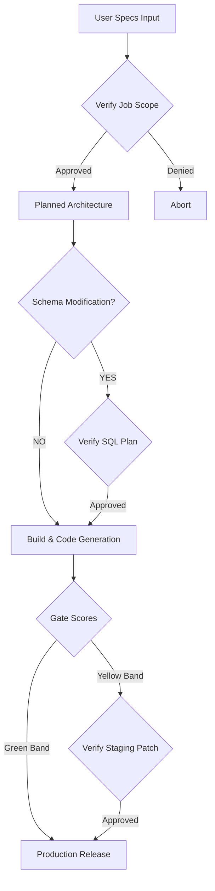
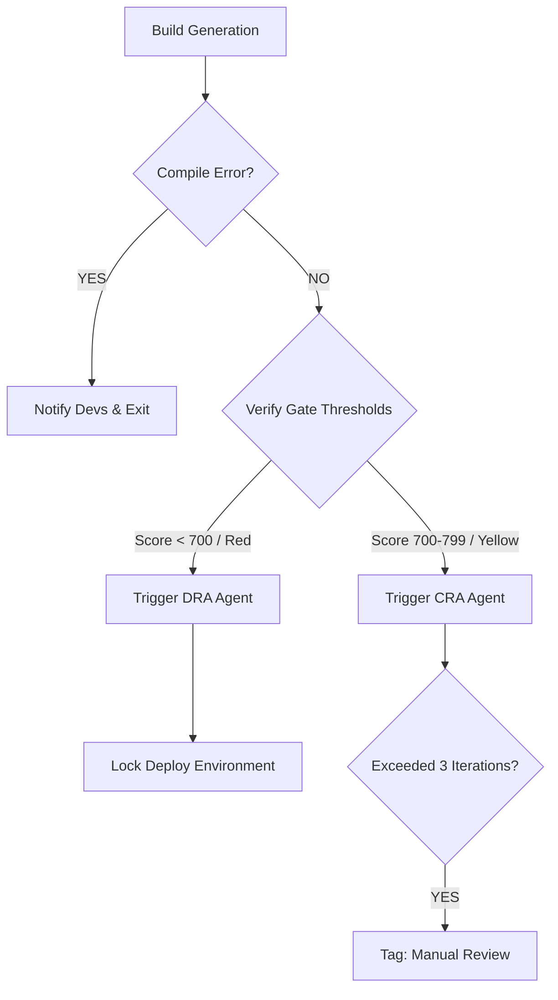
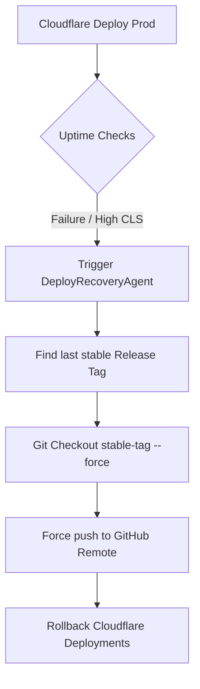

# Complete Autonomous Workflow System Architecture

This document defines the complete architectural specification for the end-to-end programmatic generation, deployment, and indexing workflow.

---

## 1. Step-by-Step Workflow Specification

### Step 1: User Input
- **Description:** Entry point where the user specifies parameters (e.g. `toolQuantity: 10`, `niche: "SEO Calculators"`).
- **Inputs:** `niche: string`, `toolQuantity: number`
- **Outputs:** `jobId: string`, `projectSpecification: JSON`
- **Responsible Skill:** Local input validator.
- **Responsible Agent:** Agent Manager (Core controller).
- **Rollback Conditions:** Invalid inputs/unsupported niche rejects job instantly.
- **Governor Checkpoints:** Limits check.
- **Human Approval:** Required.
- **GitHub Integration:** None.
- **Cloudflare Integration:** None.
- **Reporting System:** Appends "Job Started" to the local audit log.

### Step 2: Tool Planner
- **Description:** Plans database migrations, code structural architectures, and URLs.
- **Inputs:** `projectSpecification: JSON`
- **Outputs:** `architecturePlan: JSON`
- **Responsible Skill:** `db:relational-planner` / `db:performance-index`
- **Responsible Agent:** **Architect Agent** (Future)
- **Rollback Conditions:** Plan syntax errors or database relation errors.
- **Governor Checkpoints:** Policy whitelist checks.
- **Human Approval:** Recommended for schema changes.
- **GitHub Integration:** Commit plan branch.
- **Cloudflare Integration:** None.
- **Reporting System:** Logs planned tables and index maps.

### Step 3: Keyword Research
- **Description:** Discovers high-potential keywords, query volumes, and intent values.
- **Inputs:** `niche: string`
- **Outputs:** `keywordsList: Array<{ keyword: string, intent: string }>`
- **Responsible Skill:** `keyword-intent` / `competitor-analysis`
- **Responsible Agent:** **Trend Discovery Agent**
- **Rollback Conditions:** API timeouts or zero trend results.
- **Governor Checkpoints:** Rate limit checks.
- **Human Approval:** None.
- **GitHub Integration:** None.
- **Cloudflare Integration:** None.
- **Reporting System:** Exports keywords report.

### Step 4: Competitor Analysis
- **Description:** Scrapes competitor structures and generates gap requirements.
- **Inputs:** `keywordsList: Array`
- **Outputs:** `competitorGapAnalysis: JSON`
- **Responsible Skill:** `competitor-analysis`
- **Responsible Agent:** **Trend Discovery Agent**
- **Rollback Conditions:** Scraping failures.
- **Governor Checkpoints:** Scraper volume caps.
- **Human Approval:** None.
- **GitHub Integration:** None.
- **Cloudflare Integration:** None.
- **Reporting System:** Appends competitive metrics.

### Step 5: Tool Generation
- **Description:** Assembles and generates programmatic tool scripts (HTML, JS, CSS).
- **Inputs:** `architecturePlan: JSON`, `competitorGapAnalysis: JSON`
- **Outputs:** `generatedTools: Array<{ fileName: string, code: string }>`
- **Responsible Skill:** `programmatic-seo`
- **Responsible Agent:** **Code Generator Agent** (Future)
- **Rollback Conditions:** Syntax validation or parser failures.
- **Governor Checkpoints:** File size boundaries.
- **Human Approval:** None.
- **GitHub Integration:** Creates code branch.
- **Cloudflare Integration:** None.
- **Reporting System:** Compiles build logs.

### Step 6: Page Generation
- **Description:** Generates AstroJS markup pages embedding the generated tools.
- **Inputs:** `generatedTools: Array`
- **Outputs:** `generatedPages: Array<{ path: string, content: string }>`
- **Responsible Skill:** `programmatic-seo`
- **Responsible Agent:** **Code Generator Agent** (Future)
- **Rollback Conditions:** Missing front-matter properties.
- **Governor Checkpoints:** Total generation volume limits.
- **Human Approval:** None.
- **GitHub Integration:** Commits pages to codebase.
- **Cloudflare Integration:** None.
- **Reporting System:** Summarizes page layout reports.

### Step 7: SEO Audit
- **Description:** Validates technical and canonical compliance scores.
- **Inputs:** `generatedPages: Array`
- **Outputs:** `seoScorecard: Array<{ path: string, score: number }>`
- **Responsible Skill:** `html:structural-validator` / `html:link-integrity` / `html:media-accessibility`
- **Responsible Agent:** **Content Re-Writer Agent**
- **Rollback Conditions:** Score below threshold (70/100) on critical pages.
- **Governor Checkpoints:** Gating policies enforcer.
- **Human Approval:** None.
- **GitHub Integration:** None.
- **Cloudflare Integration:** None.
- **Reporting System:** Publishes technical SEO checklist metrics.

### Step 8: Quality Gate
- **Description:** Gated execution scoring readability indices, E-E-A-T tags, and schema.
- **Inputs:** `seoScorecard: Array`
- **Outputs:** `compositeHealthScore: number`
- **Responsible Skill:** `text:flesch-readability` / `text:ngram-similarity` / `html:jsonld-validator`
- **Responsible Agent:** **Content Re-Writer Agent** (Yellow remediation) / **Deploy & Recovery Agent** (Red rollback)
- **Rollback Conditions:** Score < 700.
- **Governor Checkpoints:** Core budget accumulator.
- **Human Approval:** Yes, if score falls in Yellow band (700-799).
- **GitHub Integration:** Merges PR on pass; rollback on fail.
- **Cloudflare Integration:** Block staging deploy on fail.
- **Reporting System:** Emits pass/fail status updates.

### Step 9: Cloudflare Deployment
- **Description:** Triggers Cloudflare build and pushes staging to edge servers.
- **Inputs:** `gitRef: string`
- **Outputs:** `deploymentUrl: string`
- **Responsible Skill:** `deployment`
- **Responsible Agent:** **Deploy & Recovery Agent**
- **Rollback Conditions:** Build compilation failures or Edge worker errors.
- **Governor Checkpoints:** Staged size validations.
- **Human Approval:** None.
- **GitHub Integration:** Triggers CI/CD Actions.
- **Cloudflare Integration:** Pages build trigger.
- **Reporting System:** Appends build logs.

### Step 10: Search Console Setup Queue
- **Description:** Registers the newly deployed tool URLs in the site sitemap search profile.
- **Inputs:** `deploymentUrl: string`
- **Outputs:** `gscRegistered: boolean`
- **Responsible Skill:** API Fetch utilities.
- **Responsible Agent:** **Operations Agent** (Future)
- **Rollback Conditions:** API authentication failures.
- **Governor Checkpoints:** Token scopes.
- **Human Approval:** None.
- **GitHub Integration:** None.
- **Cloudflare Integration:** None.
- **Reporting System:** GSC registration verification status.

### Step 11: Analytics Setup Queue
- **Description:** Configures event tag parameters for page tracking.
- **Inputs:** `deploymentUrl: string`
- **Outputs:** `analyticsConfigured: boolean`
- **Responsible Skill:** API Fetch.
- **Responsible Agent:** **Operations Agent** (Future)
- **Rollback Conditions:** Script payload configurations fail.
- **Governor Checkpoints:** Whitelist check.
- **Human Approval:** None.
- **GitHub Integration:** None.
- **Cloudflare Integration:** None.
- **Reporting System:** Event tracking mapping matrix.

### Step 12: AdSense Verification Queue
- **Description:** Syncs page ad layouts and adds programmatic ad slots.
- **Inputs:** `deploymentUrl: string`
- **Outputs:** `adsenseActive: boolean`
- **Responsible Skill:** `revenue-analysis`
- **Responsible Agent:** **Operations Agent** (Future)
- **Rollback Conditions:** Policy violation flags.
- **Governor Checkpoints:** Content safety rules.
- **Human Approval:** Required.
- **GitHub Integration:** None.
- **Cloudflare Integration:** None.
- **Reporting System:** Revenue viability metrics.

### Step 13: Indexing Queue
- **Description:** Submits URLs to indexation APIs.
- **Inputs:** `deploymentUrl: string`
- **Outputs:** `indexingSubmitted: boolean`
- **Responsible Skill:** API requests.
- **Responsible Agent:** **Operations Agent** (Future)
- **Rollback Conditions:** Submission quota limits.
- **Governor Checkpoints:** Quota caps.
- **Human Approval:** None.
- **GitHub Integration:** None.
- **Cloudflare Integration:** None.
- **Reporting System:** Indexing tracking logs.

### Step 14: Monitoring Queue
- **Description:** Hooks URLs to Playwright and uptime monitors.
- **Inputs:** `deploymentUrl: string`
- **Outputs:** `monitoringHooks: boolean`
- **Responsible Skill:** `integration:playwright-render`
- **Responsible Agent:** **Operations Agent** (Future)
- **Rollback Conditions:** Initial page load timeouts (> 3s).
- **Governor Checkpoints:** Memory thresholds.
- **Human Approval:** None.
- **GitHub Integration:** None.
- **Cloudflare Integration:** None.
- **Reporting System:** Initial load speeds and uptime parameters.

### Step 15: Reporting
- **Description:** Aggregates execution durations, indexing, and deployment scores.
- **Inputs:** `jobId: string`
- **Outputs:** `finalJobReport: Markdown`
- **Responsible Skill:** Local summary writer.
- **Responsible Agent:** Agent Manager.
- **Rollback Conditions:** None.
- **Governor Checkpoints:** None.
- **Human Approval:** None.
- **GitHub Integration:** Writes report to `/reports/`.
- **Cloudflare Integration:** None.
- **Reporting System:** Generates comprehensive PDF/Markdown deliverables.

---

## 2. System Flow Diagrams

### 2.1. Workflow Diagram

### 2.2. Approval Flow

### 2.3. Failure Flow

### 2.4. Rollback Flow

