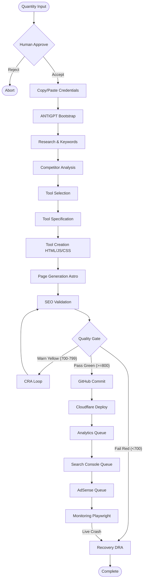

# Complete Autonomous Workflow System Architecture

This document defines the complete architectural specification for the end-to-end programmatic generation, deployment, and indexing workflow for **ANTIGPT**.

---

## 1. Step-by-Step Workflow Specification

### Step 1: Quantity Input
- **Description:** User starts the workflow by specifying how many tools to generate and the target niche.
- **Inputs:** `niche: string`, `toolQuantity: number`
- **Outputs:** `jobId: string`, `initialSpec: JSON`
- **Responsible Agent:** Core Orchestrator Controller.

### Step 2: Approve
- **Description:** A human-in-the-loop validation checkpoint to authorize the job scope, cost budgets, and safety configurations.
- **Inputs:** `initialSpec: JSON`
- **Outputs:** `isApproved: boolean`
- **Responsible Layer:** Human Approval Gate.

### Step 3: Copy/Paste Credentials
- **Description:** User securely inputs the required third-party API credentials, keys, and tokens (e.g., GitHub Personal Access Token, Cloudflare API credentials, search indexing keys).
- **Inputs:** `credentialsPayload: SecureJSON`
- **Outputs:** `sessionTokensRegistered: boolean`
- **Responsible Layer:** Credential Manager.

### Step 4: ANTIGPT (Bootstrap/Initialization)
- **Description:** The system initializes, loads the central [SkillRegistry](file:///root/src/skills/registry.ts), and executes verification checks on the credentials and sandbox resources.
- **Inputs:** None
- **Outputs:** `systemReady: boolean`
- **Responsible Layer:** ANTIGPT Runtime Engine.

### Step 5: Research
- **Description:** Performs keyword search volume, intent mapping, and niche opportunity discovery.
- **Inputs:** `niche: string`
- **Outputs:** `discoveredKeywords: Array<{ keyword: string, volume: number, intent: string }>`
- **Responsible Skill:** [keyword-intent](file:///root/src/skills/v1-skills.ts) / [tool-research](file:///root/src/skills/v1-skills.ts)

### Step 6: Competitor Analysis
- **Description:** Audits top competing domains for content depth, layout structures, and SEO gaps.
- **Inputs:** `discoveredKeywords: Array`
- **Outputs:** `competitorGapAnalysis: JSON`
- **Responsible Skill:** [competitor-analysis](file:///root/src/skills/v1-skills.ts)

### Step 7: Tool Selection
- **Description:** Analyzes opportunity scores and competitors to select the highest-potential tool ideas to generate.
- **Inputs:** `competitorGapAnalysis: JSON`, `toolQuantity: number`
- **Outputs:** `selectedToolsList: Array<string>`
- **Responsible Agent:** Trend Discovery Agent.

### Step 8: Tool Specification
- **Description:** Designs relational schemas, endpoints/routing matrices, and metadata parameters for selected tools.
- **Inputs:** `selectedToolsList: Array`
- **Outputs:** `toolSpecs: JSON`
- **Responsible Skill:** [relational-planner](file:///root/src/skills/db/relational.ts)

### Step 9: Tool Creation
- **Description:** Generates actual functional tool client-side logic (HTML inputs, interactive Javascript algorithms, clean CSS styles).
- **Inputs:** `toolSpecs: JSON`
- **Outputs:** `toolCodebase: Array<{ filename: string, content: string }>`
- **Responsible Agent:** Code Generator Agent / Tool Generation Engine.

### Step 10: Page Generation
- **Description:** Assembles AstroJS pages wrapping the interactive tools, ensuring semantic layouts.
- **Inputs:** `toolCodebase: Array`
- **Outputs:** `generatedPages: Array<{ path: string, content: string }>`
- **Responsible Agent:** Code Generator Agent.

### Step 11: SEO Validation
- **Description:** Performs rigorous technical checks including crawlability audits, heading outline hierarchies, and JSON-LD schema verification.
- **Inputs:** `generatedPages: Array`
- **Outputs:** `seoScorecard: Array<{ path: string, details: JSON }>`
- **Responsible Skill:** [structural-validator](file:///root/src/skills/html/structural.ts) / [jsonld-validator](file:///root/src/skills/html/jsonld.ts) / [link-integrity](file:///root/src/skills/html/links.ts)

### Step 12: Quality Gate
- **Description:** Runs readability scoring (Flesch index), duplicate-content checks, and EEAT evaluations. Applies the System Governor gating policy:
  - **Green (Score >= 800):** Pushes straight to Git and Production.
  - **Yellow (Score 700-799):** Blocks production, allows staging, and triggers Content Re-Writer Agent (CRA) to patch and retry.
  - **Red (Score < 700):** Aborts and triggers Deploy & Recovery Agent (DRA).
- **Inputs:** `seoScorecard: Array`
- **Outputs:** `compositeScore: number`, `gateStatus: 'Green' | 'Yellow' | 'Red'`
- **Responsible Layer:** [System Governor](file:///root/src/plugins/engine/governor.ts).

### Step 13: GitHub
- **Description:** Commits generated files, manages branches, opens a Pull Request (PR), and automatically merges it on pass status.
- **Inputs:** `generatedPages: Array`
- **Outputs:** `gitRef: string`
- **Responsible Skill:** [github-status](file:///root/src/skills/integration/github.ts)

### Step 14: Cloudflare
- **Description:** Triggers staging and production builds on Cloudflare Pages and ensures SSL health.
- **Inputs:** `gitRef: string`
- **Outputs:** `deploymentUrl: string`
- **Responsible Skill:** [cloudflare-check](file:///root/src/skills/integration/cloudflare.ts)

### Step 15: Analytics Queue
- **Description:** Injects analytics event hooks, tag manager setups, and script configurations into the templates.
- **Inputs:** `deploymentUrl: string`
- **Outputs:** `analyticsStatus: boolean`
- **Responsible Layer:** Operations Agent.

### Step 16: Search Console Queue
- **Description:** Submits the newly deployed URL index sitemaps to Google Search Console to request immediate indexing.
- **Inputs:** `deploymentUrl: string`
- **Outputs:** `indexingRequested: boolean`
- **Responsible Layer:** Operations Agent.

### Step 17: AdSense Queue
- **Description:** Injects layout-compliant AdSense slots and verified ad scripts.
- **Inputs:** `deploymentUrl: string`
- **Outputs:** `adsConfigured: boolean`
- **Responsible Skill:** [revenue-analysis](file:///root/src/skills/v1-skills.ts)

### Step 18: Monitoring
- **Description:** Launches headless Chromium runs using Playwright to audit visual stability (Cumulative Layout Shift) and check for javascript console exceptions.
- **Inputs:** `deploymentUrl: string`
- **Outputs:** `liveHealthMetrics: JSON`
- **Responsible Skill:** [playwright-render](file:///root/src/skills/integration/playwright.ts) / [accessibility-axe](file:///root/src/skills/integration/playwright.ts)

### Step 19: Recovery
- **Description:** Handles crash response by diagnosing errors, triggering rollbacks to the last verified stable git release tag, and clearing staging cache on build failure.
- **Inputs:** `crashAlert: JSON`
- **Outputs:** `recoveryStatus: JSON`
- **Responsible Skill:** [recovery](file:///root/src/skills/v1-skills.ts)
