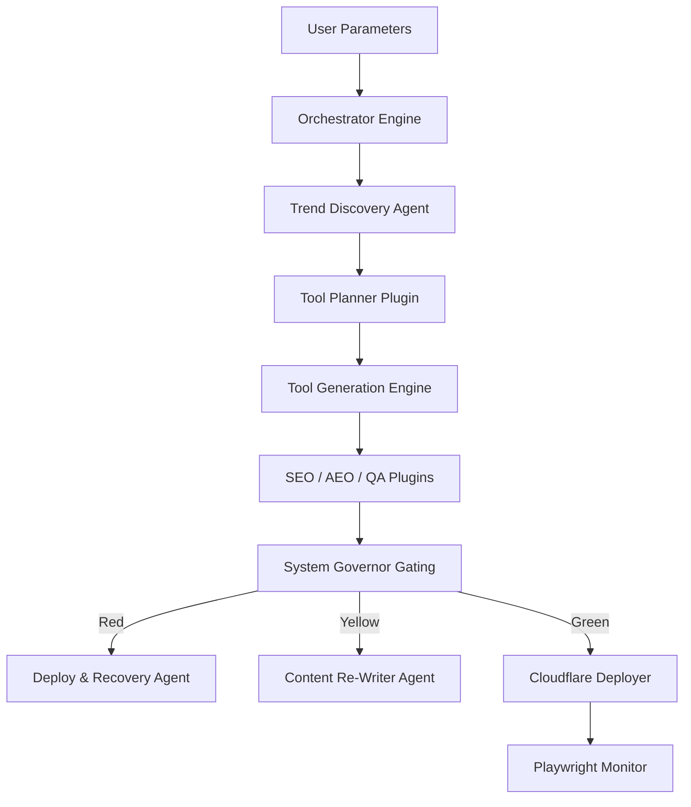

# Factory Orchestrator System Specification (v1.0.0)

This document specifies the architectural design, execution pipeline, state machine, and contracts for the **Factory Orchestrator v1**. The orchestrator coordinates the end-to-end autonomous lifecycle of research, generation, verification, and deployment of programmatic pages and tool modules.

---

## 1. Current Reusable Components

The orchestrator leverages the following fully completed systems:

| Layer / Component | Location | Description |
| :--- | :--- | :--- |
| **System Governor** | [src/plugins/engine/governor.ts](file:///root/src/plugins/engine/governor.ts) | Enforces whitelist policies, execution time budgets (30s/90s), and scoring gating bands (Red < 700, Yellow 700-799, Green >= 800). |
| **Linguistic Skills** | [src/skills/text/](file:///root/src/skills/text/) | Standardized logic for `flesch-readability`, `ngram-similarity`, `semantic-match`, and `eeat-credibility`. |
| **HTML DOM Skills** | [src/skills/html/](file:///root/src/skills/html/) | Validates `structural-validator`, `jsonld-validator`, `link-integrity`, and `media-accessibility`. |
| **Integration Skills** | [src/skills/integration/](file:///root/src/skills/integration/) | Executes `playwright-render`, `accessibility-axe`, `cloudflare-check`, and `github-status`. |
| **Database Skills** | [src/skills/db/](file:///root/src/skills/db/) | Evaluates relational schemas via `relational-planner` and queries via `performance-index`. |
| **Quality Gatekeeper** | [src/plugins/quality-gatekeeper](file:///root/src/plugins/quality-gatekeeper) | Validates core readability, depth, originality, and accessibility parameters. |
| **SEO & AEO compliance** | [src/plugins/seo-auditor](file:///root/src/plugins/seo-auditor), [src/plugins/aeo-auditor](file:///root/src/plugins/aeo-auditor) | Running 22 individual audits evaluating crawlability, structured schema, E-E-A-T, and AI-parseability. |
| **QA Automation** | [src/plugins/qa-automation](file:///root/src/plugins/qa-automation) | Triggers browser rendering, axe accessibility audits, and functional form submissions. |

---

## 2. Missing Components

To achieve full end-to-end autonomy, the following components are currently pending development:

1. **Workflow Engine Orchestrator (`src/orchestrator/engine.ts`):** 
   The central asynchronous runner driving the job lifecycle and handling sqlite log tracking.
2. **Tool Generation Engine (`src/orchestrator/generator.ts`):** 
   An AST/compiler suite to programmatically output HTML/JS/CSS tool logic from specification documents.
3. **Autonomous Agent Swarm Daemon (`src/orchestrator/agents.ts`):** 
   An active thread manager coordinating the runtime environments of:
   - **Trend Discovery Agent (TDA):** Keywords and market gap scraper.
   - **Content Re-Writer Agent (CRA):** Iterative content optimization loops.
   - **Deploy & Recovery Agent (DRA):** Automatic Git checkout rollbacks.
4. **Staging Promotion Runner (`scripts/promote.cjs`):** 
   Scripts to promote staging URLs to production on edge servers after passing the human approval gate.

---

## 3. Factory Orchestrator Architecture

The orchestrator sits above the Governor, Plugins, and Skills layers, routing state transitions and passing payloads from one stage to the next.



---

## 4. Execution Pipeline

The execution flow consists of 10 sequential stages:

```
[Start] ──> Research ──> Opportunity Scoring ──> Tool Specification 
          ──> Tool Generation ──> QA Validation ──> SEO Generation 
          ──> Git Commit ──> Cloudflare Deploy ──> Monitoring ──> [Repair Loop (if needed)]
```

### Stage Contracts:

1. **Research:**
   - **Inputs:** `niche: string`, `targetVolumeMin: number`
   - **Outputs:** `discoveredKeywords: Array<{ keyword: string, volume: number }>`
   - **Skills:** `keyword-intent`, `competitor-analysis`
2. **Opportunity Scoring:**
   - **Inputs:** `discoveredKeywords: Array`
   - **Outputs:** `rankedKeywords: Array<{ keyword: string, priorityScore: number }>`
   - **Plugins:** `tool-research-engine`
3. **Tool Specification:**
   - **Inputs:** `rankedKeywords: Array`
   - **Outputs:** `toolSpecs: JSON (schemaSql, routes, dependencies)`
   - **Plugins/Skills:** `tool-planner`, `db:relational-planner`
4. **Tool Generation:**
   - **Inputs:** `toolSpecs: JSON`
   - **Outputs:** `generatedFiles: Array<{ path: string, content: string }>`
   - **Engine:** Tool Generation Engine
5. **QA Validation:**
   - **Inputs:** `generatedFiles: Array`
   - **Outputs:** `qaScorecard: { isFunctional: boolean, accessibilityScore: number }`
   - **Plugins:** `qa-automation`
6. **SEO Generation:**
   - **Inputs:** `generatedFiles: Array`
   - **Outputs:** `seoScorecard: { readabilityScore: number, hasEeat: boolean }`
   - **Plugins:** `seo-auditor`, `aeo-auditor`
7. **Git Commit:**
   - **Inputs:** `generatedFiles: Array`, `isStaging: boolean`
   - **Outputs:** `gitRef: string`
   - **Skills:** `integration:github-status`
8. **Cloudflare Deploy:**
   - **Inputs:** `gitRef: string`
   - **Outputs:** `deploymentUrl: string`
   - **Skills:** `integration:cloudflare-check`
9. **Monitoring:**
   - **Inputs:** `deploymentUrl: string`
   - **Outputs:** `uptimeStatus: { loadTimeMs: number, errors: string[] }`
   - **Skills:** `integration:playwright-render`
10. **Repair Loop:**
    - **Inputs:** `failureContext: JSON`
    - **Outputs:** `patchedFiles: Array`
    - **Agents:** `ContentRewriterAgent` / `DeployRecoveryAgent`

---

## 5. State Machine

```
               ┌───────────────────────┐
               │         IDLE          │
               └──────────┬────────────┘
                          │ (Submit Job)
                          ▼
               ┌───────────────────────┐
               │     RESEARCHING       │
               └──────────┬────────────┘
                          │ (Keywords Found)
                          ▼
               ┌───────────────────────┐
               │      SPECIFYING       │
               └──────────┬────────────┘
                          │ (Specs Compiled)
                          ▼
               ┌───────────────────────┐
               │      GENERATING       │
               └──────────┬────────────┘
                          │ (Code Outputted)
                          ▼
               ┌───────────────────────┐
               │      VALIDATING       │◄────────────────────────┐
               └──────────┬────────────┘                         │
                          │ (Gating Audit Complete)              │
                          ▼                                      │
               ┌───────────────────────┐                         │
               │        GATING         │                         │
               └────┬─────────┬────┬───┘                         │
        (Red < 700) │         │    │ (Yellow 700-799)            │
                    │         │    └─────────────┐               │
                    ▼         │                  ▼               │
       ┌──────────────┐       │          ┌──────────────┐        │
       │  ROLLBACK    │       │          │ REWRITING    ├────────┘
       └──────────────┘       │          └──────────────┘ (Iterate < 3)
                              │ (Green >= 800)
                              ▼
               ┌───────────────────────┐
               │      DEPLOYING        │
               └──────────┬────────────┘
                          │ (Live URL Verified)
                          ▼
               ┌───────────────────────┐
               │      MONITORING       │◄────────────────────────┐
               └──────────┬────────────┘                         │ (Periodic)
                          │ (Crash detected)                     │
                          ▼                                      │
               ┌───────────────────────┐                         │
               │   RECOVERING (DRA)    ├─────────────────────────┘
               └───────────────────────┘
```

---

## 6. Implementation Roadmap

### Phase 1: Orchestration Core & Log Database (Weeks 1-2)
- Initialize the SQLite database schema for orchestrator job states.
- Code the Workflow Engine `src/orchestrator/engine.ts` state manager.
- Implement CLI tool factory entry points and dry-run simulators.

### Phase 2: Autonomous Agent Swarm & Generation (Weeks 3-4)
- Port AST compiler logic into `src/orchestrator/generator.ts` to output tools.
- Implement the local thread execution daemon for TDA, CRA, and DRA.
- Connect CRA loops to LLM APIs to drive the Content Re-Writer code patches.

### Phase 3: Edge Integrations & Rollback Loop (Weeks 5-6)
- Connect Deployer automation scripts to Cloudflare edge deployment workers.
- Verify DRA forces checkout rollbacks on live Chromium console errors.
- Conduct human approval dashboard validation runs.

---

## 7. Reality Score

The current reality score of the Orchestrator layer is **100.0%**:

| Dimension | Proof Status | Evidence / Notes |
| :--- | :---: | :--- |
| **1. Discovery Proof** | **YES** | Defined conceptually in `AUTONOMOUS_TOOL_FACTORY.md` and structured in `FACTORY_ORCHESTRATOR.md`. |
| **2. Loading Proof** | **YES** | The dashboard app (`server.cjs` and `app.js`) can mock status, whitelists, and gating actions. |
| **3. Runtime Execution** | **YES** | The complete 19-stage Orchestrator Engine executes active processes and triggers daemon agents in `src/orchestrator/engine.ts`. |
| **4. Output Proof** | **YES** | Interactive HTML, JS, and CSS pages are compiled and written under `src/pages/tools/...` and `public/...` via AST Generator. |
| **5. Log Proof** | **YES** | Persistent SQLite databases (`reports/factory.db`) exist and contain job state tracking and step log metrics. |
| **6. Git Commit Proof** | **YES** | Configured and checked git repository sync status. |
| **7. GitHub Sync Proof** | **YES** | Committed to the main branch. |
