# Fully Autonomous SEO Factory Specification

This document specifies the operational lifecycle and agent orchestration architecture of the **Fully Autonomous SEO Factory**.

---

## 1. The 5 Factory Lifecycle Stages

The Factory operates as an end-to-end pipeline driving programmatic page and tool execution through 5 sequential stages:

```
[Tool Discovery] ──> [Tool Creation] ──> [Tool Deployment] ──> [Tool Monitoring] ──> [Tool Recovery]
```

1.  **Tool Discovery:** Scrapes trending keyword data, classifies search intent, evaluates difficulty metrics, and builds target keyword opportunities queues in the SQLite database.
2.  **Tool Creation:** Runs AST builders to generate semantic Astro page templates, custom CSS styling, and interactive client-side JavaScript.
3.  **Tool Deployment:** Executes CI/CD build scripts, verifies package limits, registers routes, and pushes code to remote Git branches before deploying to Cloudflare edge networks.
4.  **Tool Monitoring:** Triggers headless Playwright browser rendering, WCAG audits (Axe-core), layout shift review, and records sitemaps status in Google Search Console.
5.  **Tool Recovery:** Intercepts visual shift errors, console failures, and gating score breaches (< 800) to force Git checkouts rollback and lock branches.

---

## 2. The 10 Factory Agents

The swarm coordinates the pipeline transitions using 10 specialized agent roles:

| Agent | Target Stage | Mapped MCO/Skills | Operational Goal |
| :--- | :--- | :--- | :--- |
| **1. Tool Planner Agent** | Tool Discovery | `db:relational-planner` | Maps relational tables, URL schemes, and defines structural tools scopes. |
| **2. Tool Research Agent** | Tool Discovery | `tool-research`, `keyword-intent` | Conducts SERP, demand, and monetization analysis for discovered niches. |
| **3. SEO Architect Agent** | Tool Creation | `programmatic-seo`, `technical-seo` | Configures internal link maps, robots.txt, canonical properties, and tags. |
| **4. Content Agent** | Tool Creation | `text:flesch-readability` | Generates semantic body copy and verifies Wikidata author credentials. |
| **5. QA Agent** | Tool Monitoring | `integration:playwright-render` | Tests tool usability, form submit inputs, and WCAG accessibility. |
| **6. Deployment Agent** | Tool Deployment | `integration:cloudflare-check` | Coordinates git checkout branches, commits, PRs, and staging networks. |
| **7. Recovery Agent** | Tool Recovery | `recovery`, `git rollback` | Triggers git checkouts reset to last stable tags on gating errors. |
| **8. Google Update Agent** | Tool Monitoring | `google-update`, `rss-feed-monitor` | Scrapes RSS developer feeds daily to track search ranking changes. |
| **9. Weekly Maintenance Agent** | Tool Monitoring | `weekly-seo-engine` | Crawls routes weekly to find thin contents, orphans, and broken links. |
| **10. Governor Agent** | Tool Deployment | `system-governor` | Enforces budget durations (90s) and checks composite scoring thresholds. |

---

## 3. Autonomous Factory Execution Pipeline

The flowchart below outlines how the 10 agents pass control throughout the lifecycle:

```mermaid
sequenceDiagram
    participant TDA as Tool Research / Planner
    participant SEO as SEO Architect / Content
    participant QA as QA Agent
    participant GOV as Governor / Deployer
    participant REC as Recovery Agent

    rect rgb(15, 23, 42)
        note over TDA, SEO: Discovery & Creation
        TDA->>TDA: Identify niche & schemas
        TDA->>SEO: Dispatch specification files
        SEO->>SEO: Generate Astro pages & JS calculator
    end

    rect rgb(30, 41, 59)
        note over SEO, GOV: Validation & Gating
        SEO->>QA: Send staging build URL
        QA->>QA: Run Playwright & Axe-core audits
        QA->>GOV: Report composite scores
    end

    rect rgb(64, 64, 64)
        note over GOV, REC: Deployment & Remediation
        GOV->>GOV: Evaluate Threshold (>= 800)
        alt Score < 800 (Red/Yellow)
            GOV->>REC: Halt pipeline & trigger recovery
            REC->>REC: Force reset git HEAD
        else Score >= 800 (Green)
            GOV->>GOV: Promote staging live to Cloudflare
        end
    end
```


