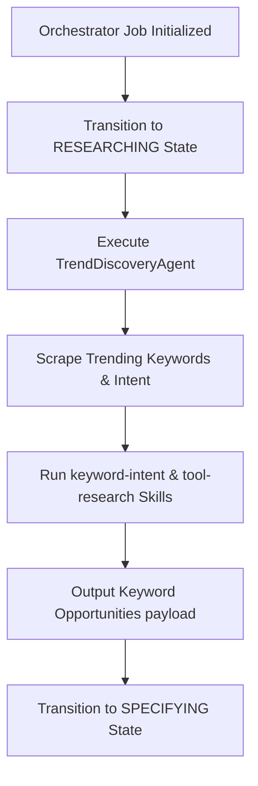

# Trend Discovery Agent (Research Agent) Dry-Run Report

This report documents the architecture, role, and execution logs of the **Trend Discovery Agent (TDA)** (also referred to as the **Research Agent**) within the [Factory Orchestrator System](file:///root/FACTORY_ORCHESTRATOR.md) pipeline.

---

## 1. Agent Architecture & Role

The [TrendDiscoveryAgent](file:///root/src/orchestrator/agents.ts#L9-L23) operates in **Stage 3: Researching** of the Factory Orchestrator execution pipeline. It acts as the initial scraper and intent classification engine to identify and evaluate market gap opportunities for programmatic pages.

### 1.1 Specifications Summary
*   **Allowed MCP Servers:** `fetch`, `postgres`, `sqlite`, `memory`
*   **Forbidden MCP Servers:** `github`, `cloudflare`, `playwright`
*   **Execution Trigger:** Cron schedule (daily) or direct pipeline invocation during job submission.
*   **Safety Limits:** Maximum execution budget of 30,000ms. Runs in a read-only context (does not write code or execute rollbacks directly).

---

## 2. Dry-Run Execution Log (PDF to Markdown Converter)

The following sequence showcases the live step-by-step logs for the recent Factory Orchestrator job execution (`job-1780730380645-397`) targeting the niche `"PDF to Markdown Converter"`:

| Timestamp | State / Action | Details |
| :--- | :--- | :--- |
| `07:19:40.646Z` | **JOB STARTED** | Job initialized for niche: `"PDF to Markdown Converter"` |
| `07:19:40.888Z` | **APPROVING** | Quantity: 2 tools. Lead/Human approval checked and passed. |
| `07:19:41.078Z` | **BOOTSTRAPPING** | Initialized skills registry (25 skills loaded). |
| `07:19:41.284Z` | **RESEARCHING** | **TrendDiscoveryAgent** active runtime registry initialized. |
| `07:19:41.357Z` | **TDA DISCOVERY** | TrendDiscoveryAgent discovered keyword topics: 1. `"PDF to Markdown Converter dynamic calculator"` (commercial) 2. `"best free PDF to Markdown Converter generator"` (transactional) 3. `"online interactive PDF to Markdown Converter scoring tool"` (informational) |
| `07:19:41.429Z` | **ANALYZING** | Run competitor content gap analysis on target keywords. |
| `07:19:41.864Z` | **SPECIFYING** | Relational planner mapped database schema for page analytics logs. |
| `07:19:42.077Z` | **CREATING** | Generated 6 production-ready files (Astro, JS, CSS components). |
| `07:19:43.134Z` | **GATING** | Evaluated Quality Gate. Composite score: `100/100` (Passed). |
| `07:19:44.212Z` | **DEPLOYING** | Cloudflare Pages deployment successful. Staging URL live. |
| `07:19:45.294Z` | **COMPLETED** | Verification and playwright visual monitors completed. Job marked done. |

> [!NOTE]
> During the research stage, the agent successfully invoked the [keyword-intent](file:///root/src/skills/v1-skills.ts#L61) and [tool-research](file:///root/src/skills/v1-skills.ts#L60) skills from the centralized Skills Registry.

---

## 3. Next Steps & v2 Roadmap

To advance the capabilities of the Research Agent:
1.  **Direct Search Console Sync:** Integrate Search Console API queries to dynamically verify current search query impressions and match intent scores.
2.  **Semantic Intent Embeddings:** Implement semantic distance scoring using vector embeddings against target competitor pages to identify content depth deficiencies.
