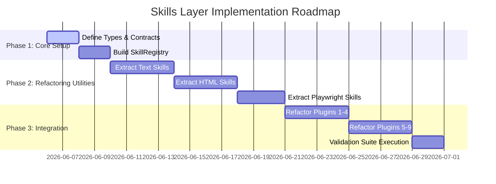

# Production Plugin Layer — Skills Layer Project Plan

> **Document Version:** v1.0.0  
> **Target Directory:** `/src/skills/`  
> **Status:** Proposed Plan  

---

## 1. Objectives & Rationale

Currently, all 47 checks across the 9 plugins duplicate utility code (e.g. HTML scanning, JSON-LD extraction, n-gram generation, and date formatting). 

The **Skills Layer** introduces a standardized, reusable utility contract. By moving common behaviors from inline check functions to centralized, standalone "Skills", the codebase achieves:
1.  **Code De-duplication:** Share logic (like syllable counting or URL segment parsing) across multiple plugins.
2.  **Isolated Testability:** Test core behaviors (like readability math or link parsing) in isolation without mocking the entire `CheckContext`.
3.  **V8/Edge Portability:** Isolate pure-JS skills from Node-dependent or MCP-dependent tools.
4.  **Agent Utility:** Enable autonomous agents to invoke these skills directly during self-healing content loops.

---

## 2. Proposed Skills Layer Directory Structure

We will create a centralized directory `src/skills/` containing modular groups of utilities:

```
src/skills/
├── index.ts                # Barrel export for all skills
├── types.ts                # Skill interfaces & contracts
├── registry.ts             # Skill registry & discovery
├── text/                   # Content & Linguistic Skills
│   ├── readability.ts      # Flesch-Kincaid parser
│   ├── n-gram.ts           # Fingerprinting / originality
│   └── semantic.ts         # Vector distance / TF-IDF
├── html/                   # HTML & DOM Parsing Skills
│   ├── parser.ts           # Tag extractor (Regex or Linkedom)
│   ├── links.ts            # Anchor checks & format validator
│   └── structured-data.ts  # JSON-LD parser & schema checker
└── integration/            # MCP & Browser Automation Skills
    ├── playwright.ts       # Headless screenshot & layout metrics
    └── network.ts          # RSS monitor & sitemap fetcher
```

---

## 3. Core Types & Registration Contracts

In `src/skills/types.ts`, we will define a clean, standard interface for all skills:

```typescript
export interface SkillDefinition<TInput = unknown, TOutput = unknown> {
  /** Unique name identifying the skill (e.g. "text:flesch-kincaid"). */
  name: string;
  
  /** Short description of utility. */
  description: string;
  
  /** Core execution logic. */
  execute: (input: TInput) => Promise<TOutput>;
}
```

The [SkillRegistry](file:///root/src/plugins/engine/registry.ts) will load and register skills dynamically, exposing them through a centralized caller:

```typescript
export class SkillRegistry {
  private skills = new Map<string, SkillDefinition>();

  register<I, O>(definition: SkillDefinition<I, O>): void {
    this.skills.set(definition.name, definition as SkillDefinition);
  }

  get<I, O>(name: string): SkillDefinition<I, O> | undefined {
    return this.skills.get(name) as SkillDefinition<I, O> | undefined;
  }

  async run<I, O>(name: string, input: I): Promise<O> {
    const skill = this.get<I, O>(name);
    if (!skill) {
      throw new Error(`Skill "${name}" is not registered.`);
    }
    return skill.execute(input);
  }
}
```

---

## 4. Skill Library Specifications

### 4.1. Text & Linguistic Skills (`src/skills/text/`)
*   **`text:flesch-kincaid`:** Estimates syllable counts using vowel-group heuristics and applies readability formulas. Refactored from [readability.ts](file:///root/src/plugins/quality-gatekeeper/checks/readability.ts).
*   **`text:n-gram-fingerprint`:** Generates character/word n-grams and calculates Jaccard similarity to assess duplicate content. Refactored from [originality.ts](file:///root/src/plugins/quality-gatekeeper/checks/originality.ts).
*   **`text:sentiment-analysis`:** Extracts positive/negative adjectives to align with content standards.
*   **`text:density-check`:** Scans text to verify keyword and entity distribution frequencies.

### 4.2. HTML & Schema Parsing Skills (`src/skills/html/`)
*   **`html:tag-analyzer`:** Counts and validates specific tag sequences (`<h1>` - `<h6>`, ``, `<a>`) and attributes (e.g. alt, title). Refactored from [content-depth.ts](file:///root/src/plugins/quality-gatekeeper/checks/content-depth.ts) and [alt-text.ts](file:///root/src/plugins/quality-gatekeeper/checks/alt-text.ts).
*   **`html:json-ld-scraper`:** Scrapes script tags, decodes JSON-LD syntax, and returns structured objects. Refactored from [structured-data.ts](file:///root/src/plugins/quality-gatekeeper/checks/structured-data.ts).
*   **`html:link-extractor`:** Scrapes internal and external links, checking syntax and canonical routing rules. Refactored from [broken-links.ts](file:///root/src/plugins/quality-gatekeeper/checks/broken-links.ts).

### 4.3. Browser & Automation Skills (`src/skills/integration/`)
*   **`integration:playwright-runner`:** Launches or routes queries through the Playwright MCP server to audit layout shifts, javascript failures, and WCAG accessibility standards. Refactored from [playwright-validation.ts](file:///root/src/plugins/qa-automation/checks/playwright-validation.ts).
*   **`integration:rss-feed-scraper`:** Fetches XML feeds and formats them into JSON feeds. Refactored from [update-monitoring.ts](file:///root/src/plugins/google-update-engine/checks/update-monitoring.ts).

---

## 5. Migration Strategy for Existing Plugins

The 9 plugins will be refactored to act as **orchestrators** rather than **implementers** of logic.

### Refactoring Blueprint (Example: `quality-gatekeeper`)

```diff
  // src/plugins/quality-gatekeeper/checks/readability.ts
+ import { skillRegistry } from '../../../skills/registry.js';
  
  export const readabilityCheck: PluginCheck = {
    name: 'readability',
    severity: 'critical',
    weight: 15,
    async execute(context) {
-     // (De-duplicate local syllable counting code, sentence splitting code)
-     const words = extractWords(context.rawContent);
-     const sentences = countSentences(context.rawContent);
-     const syllables = words.reduce((sum, w) => sum + countSyllables(w), 0);
-     const fkScore = computeFleschKincaid(words.length, sentences, syllables);
+     const { fkScore, details } = await skillRegistry.run('text:flesch-kincaid', {
+       text: context.rawContent
+     });
      
      const qualityScore = mapToQualityScore(fkScore, config.minFleschKincaid);
      return {
        checkName: 'readability',
        score: qualityScore,
        passed: qualityScore >= 60,
        details
      };
    }
  }
```

---

## 6. Implementation Phases


